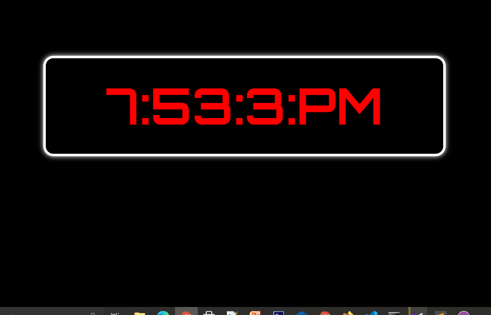

# Digital Clock

<b>Digital Clock in Javascript</b>

## Functionality
<b>
<li> Digial clock </li>
<li> Check exact Time </li>

## Tech Stack
</b>
<li>HTML5</li>
<li>CSS3</li>
<li>Bootstrap 4.5</li>
<li>Javascript ES6</li>
<li>Github Actions</li></li>
<li>Github Pages</li>

## Clone Repo
https://github.com/Babar-Ahmed/digitalClock.github.io.git
 

<b>click repo then click code and selecte the url of the repo
goto cmd command propmt type git clone "past here repo url"</b>
